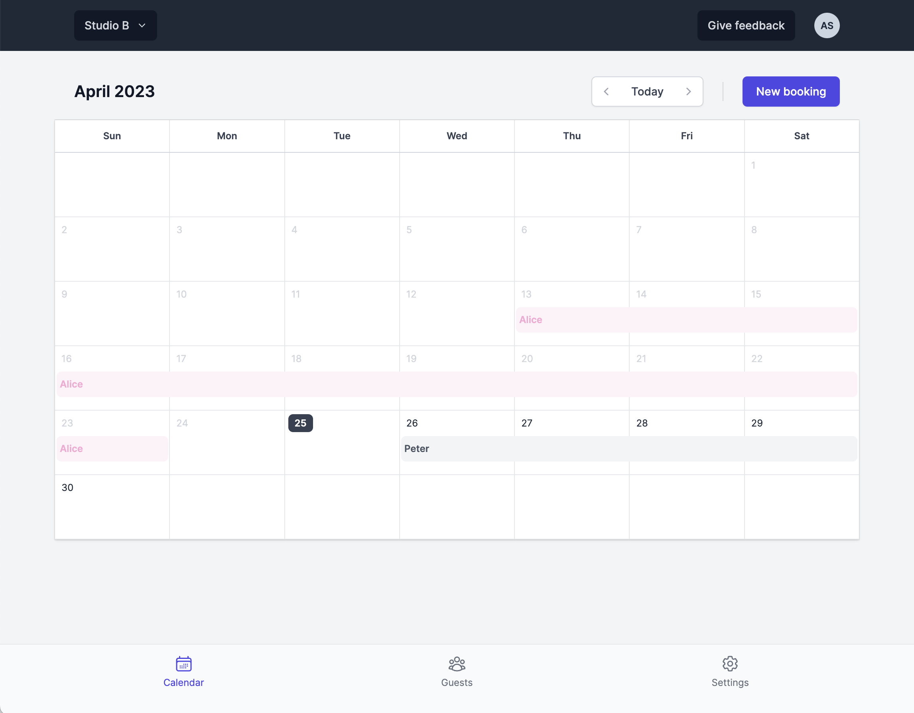
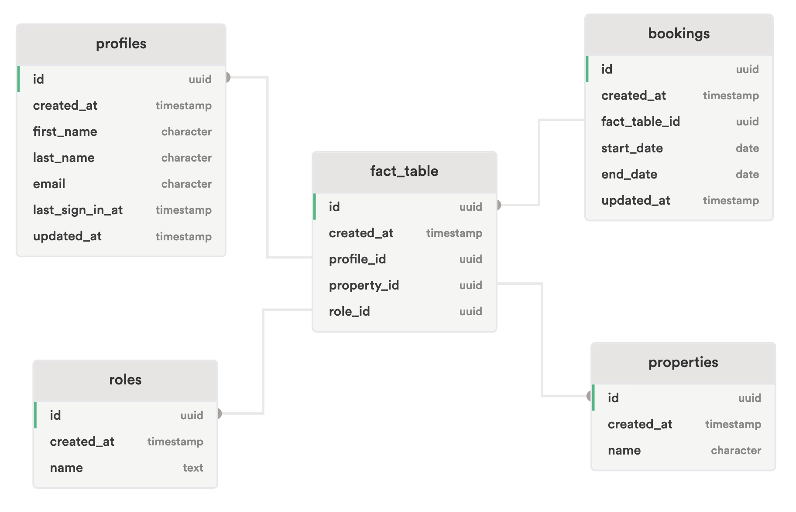

<h2 align="center">Bookie</h2>

    Manage your holiday home through a shared calendar 
    <a href="https://bookie-twentytwo.vercel.app/">View app</a>

## About this project

Bookie is a user-friendly platform designed to assist families and friends in managing their jointly owned vacation homes.

### Tech stack

- [ReactJS](https://react.dev/)
- [NextJS](https://nextjs.org/)
- [TailwindCSS](https://tailwindcss.com/)
- [Supabase](https://supabase.com/) - Used for Postgres database, authentication and file-storage.

## Getting Started

### Requirements

- Node.js (version 18.16.0)
- npm

### Setup

- Run `npm i` to install depencies
- Copy `.example.env` and rename it to `.env`
- Add the various Supabase keys to the `.env` file

### Development

- Run `npm run dev` to start the development server, and open [http://localhost:3000](http://localhost:3000) with your browser

### Deployment

The app is hosted on [Vercel](https://vercel.com/). Every commit pushed to the `main` branch will trigger a Production Deployment.

## Other information

### Database diagram

### Using dates

Dates in the Postgres database are stored in the the ISO 8601 format (YYYY-MM-DD). There is no time information stored.
When working with dates in the front-end, a date is parsed to a Date object using date-fns.

### Tasks

- Add invite accepted state to landingpage OR create custom page to which users that click Accept invite get redirected to
- Loading skeleton
- Invite emails
- Showing calendar directly in overlay and add spinner to heading (to avoid jump in modal content size)
- Ask for first and last name after account creation
- Check order of actions in invite api endpoint when inviting guest
- Move first/last name to metadata
- Fix booking query keys
